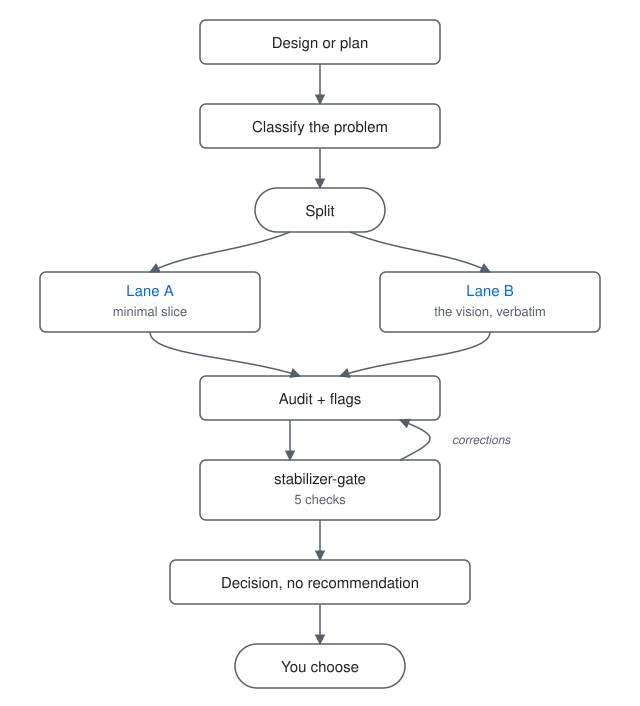
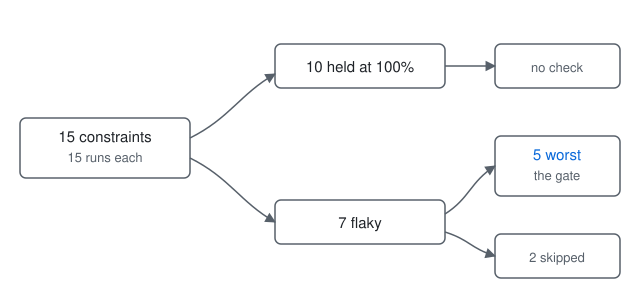

# Plan Stabilizer

An agent says "I can do that!" with real enthusiasm. You read the plan, you review it, it
looks fine. Neither of you says the thing an experienced engineer would say out loud: this
isn't an MVP, it isn't even feature-sized. Two days and 32 iterations later, you find out
it overscoped the whole thing and nothing holds together.

You were building a rocket ship. Nobody involved knew aerodynamics or how to make fuel.

Stabilizer splits an agentic plan into the part that survives examination and the part the
agent is only asserting, then makes you pick before anyone writes code.

Two agent skills. Plain markdown, nothing vendor-specific.

---

## How it works

Two questions run first, because the lane split has preconditions and forcing it where they fail produces a scope-down that cannot survive review:

- **Would stopping halfway be worth anything?** The one-hour question below assumes value is roughly linear in scope, so a fraction of the work delivers a fraction of the value. That inverts on partition work: refactors, migrations, renames, terminology sweeps, dependency upgrades, de-duplication. There the value is a global property ("small enough to read end to end"), a half-partitioned state fails it exactly as hard as an untouched one, and half a rename is worse than no rename. When the answer is no, stabilizer reports a completion state, a checkpoint sequence, and a rollback per checkpoint instead of two lanes, and the choice becomes ship the whole partition now or defer it.
- **Has this plan already been scoped?** A plan arriving with `[MUST]` and `[MAY]` tags already carries its author's Lane A and Lane B. Re-deriving them invites regression, because the second answer is systematically smaller than the first: that is the direction Lane A pulls. Stabilizer audits those tags for consistency and coverage instead of re-asking a question the author already answered.

On an unscoped plan whose value is linear in scope, four steps:

1. **Classify the problem** — Is this FEATURE, FOUNDATION, INTEGRATION, or EXPERIMENT? Classification determines how aggressively Lane A gets compressed. A single-file validation bug is FEATURE even if the design proposes a cross-module refactor. A data migration touching auth is FOUNDATION even if the design looks small.

2. **Split into two lanes** —
   - **Lane A (Minimal Deterministic Slice):** If you had one hour, what would you ship? One guard, one reorder, one constraint — plus the invariants that must still hold in six months, a rollback path, and two tests (reproduction + regression). No new abstractions unless a MUST invariant requires one.
   - **Lane B (System Vision):** The original brainstorming output, copied verbatim, tagged with RFC 2119 labels. MUST items are already in Lane A. SHOULD items are Phase 2 candidates. MAY items are Phase 3+.

3. **Run gate checks** — Scan for five specific failure patterns and flag them RED, YELLOW, or GREEN. Each flag includes the exact quoted sentence from the plan and the smallest concrete patch to fix it.

4. **Name the options, but don't ask yet** — Stabilizer renders the audit and states the choice as text. It does not open the dialog, because the checks that follow can still reclassify the problem or move an item out of Lane A.

Then `stabilizer-gate` runs automatically: five checks on the constraints the first skill is statistically weakest at, and then, last, the decision, asked on the corrected audit rather than the draft.



---

## Two modes

| Mode | Trigger | Output | Rewrites plan? |
|------|---------|--------|----------------|
| **Audit** (default) | Auto after brainstorming/plan | Lanes + flags + decision prompt | Never |
| **Commit** | Manual `/stabilizer` | Implementation steps, PR scope, diffs | Only Lane A, only after user chooses |

Audit mode is a lens, not a gatekeeper. It labels and asks. It never blocks, recommends Lane A as morally superior, or quietly minimizes your vision.

---

## What it looks like

### Example 1 — FEATURE class

A one-line bug, and a plan that answered it with four items.

```
Our warehouse tool accepts negative quantities on stock adjustments, which corrupts
downstream reorder calculations.

Plan: fix the validation, add input sanitization across all 47 form fields, refactor
the validation layer into a reusable framework, add unit tests for all validators.
```

Item three is the tell. Nobody's said what the framework is, what goes in it, or why a
one-field bug needs one. It reads like work because it's phrased like work, so it gets past
you unless you're specifically hunting for scope. You find out on day two, when the
framework has to stop being a phrase and start being a thing.

Stabilizer runs on it automatically:

```
STABILIZER AUDIT
================
Classification: FEATURE — the bug is a single-field validation gap. The design is
ambitious; the problem is not.

Lane A (smallest shippable slice):
  Objective:  make a negative stock quantity impossible to submit
  Diff boundary: one guard in the adjustment handler
  Invariants: stock quantity is never negative, at any entry point
  Rollback:   revert one commit
  Tests:      repro (negative rejected) + regression (zero and positive still pass)

Lane B (preserved vision):
  "fix the validation"                                    MUST → in Lane A
  "add comprehensive input sanitization across all 47 form fields"   SHOULD
  "refactor the validation layer into a reusable framework"          MAY
  "add unit tests for all validators"                                SHOULD

Flags:
  RED    "refactor the validation layer into a reusable framework"
         Capability before constraint: the framework is new surface area, the guard
         is the fix. Patch: move the refactor to Lane B, ship the guard alone.
  YELLOW "add comprehensive input sanitization across all 47 form fields"
         Smallest fix is in the plan but buried under larger work.
         Patch: name the one field in Lane A, keep the other 46 as SHOULD.

Decision required:
  → Ship Lane A only
  → Ship Lane A + selected SHOULD items: [name them]
```

Nothing got deleted. The framework is still on the page, tagged MAY, sitting where you can
see it for what it is: something the agent proposed. Lane A is the part that holds up when
you push on it. That's what "minimal deterministic slice" means, and the determinism is the
half that matters.

### Example 2 — FOUNDATION class

Same tool, different problem. The auth migration touching user roles can't be treated like a feature.

```
We're migrating user roles from a string column to a formal RBAC table. The migration
needs to run without downtime, preserve existing permissions, and roll back cleanly.

Plan: create the RBAC schema, write a zero-downtime migration with dual-write logic,
add a feature flag for gradual rollout, build an admin UI for role management, and
create a rollback script.
```

FOUNDATION problems get full rigor. SHOULD items get promoted, not parked.

```
STABILIZER AUDIT
================
Classification: FOUNDATION — touches auth, data integrity, and a migration. Full rigor
required regardless of how small the design looks.

Lane A (smallest shippable slice):
  Objective:  make a failed migration impossible to deploy without a rollback path
  Diff boundary: migration script + dual-write adapter + rollback script
  Invariants: no user loses permissions during migration; rollback restores exact state
  Rollback:   run rollback script; feature flag disables new path
  Tests:      repro (migration fails mid-run, rollback succeeds) + regression
               (dual-write keeps both paths consistent)

Lane B (preserved vision):
  "create the RBAC schema"                           MUST → in Lane A
  "write a zero-downtime migration with dual-write"    MUST → in Lane A
  "add a feature flag for gradual rollout"             SHOULD → promoted to Lane A
  "build an admin UI for role management"              MAY
  "create a rollback script"                           MUST → in Lane A

Flags:
  GREEN  Invariant clarity: "no user loses permissions" and "rollback restores exact
         state" are explicit and tested.
  YELLOW "build an admin UI for role management"
         New surface area for a FOUNDATION class problem. Patch: keep as MAY in Lane B.

Decision required:
  → Ship Lane A only
  → Ship Lane A + MAY item: build admin UI
```

The admin UI is exciting, but excitement is not a MUST. Tag it MAY and present it as an option.

---

## The four classifications

Classification determines how hard Lane A gets compressed, tailored to how much risk the problem actually carries.

| Class | When | Lane A behavior | Lane B behavior |
|-------|------|-----------------|-----------------|
| **FEATURE** | Product iteration, UI, new endpoints, user-facing | Minimal slice prioritized. Most Lane B items → MAY | Preserved verbatim |
| **FOUNDATION** | Infra, safety, data integrity, auth, rate limiting, migrations, abuse prevention | Full rigor. SHOULD items get promoted. | Preserved. Interfaces designed now. |
| **INTEGRATION** | Cross-boundary (pipeline+DB+API+UI, auth flows, distributed) | Must include boundary contract tests + rollback | Ambitious but expressed as seams/interfaces only |
| **EXPERIMENT** | Spikes, research, prototypes, eval runs | Maximum learning speed. Prove one thing. | Just notes for later |

---

## The five gate checks

After splitting lanes, the audit scans for these patterns. Each flag includes the exact quoted sentence from the plan and the smallest concrete patch to resolve it.

| Gate | Question | RED if... | YELLOW if... |
|------|----------|-----------|--------------|
| **Invariant clarity** | What MUST be true 6 months from now? | No invariants identified | Invariants exist but aren't tested |
| **Smallest fix exists** | Is there a single change that makes failure impossible? | Yes, but plan doesn't include it | Smallest fix is in plan but buried under larger work |
| **New surface area** | Does plan add enums, modes, tiers, flags, services? | Adds surface area for FEATURE/EXPERIMENT class | Adds surface area for FOUNDATION/INTEGRATION class |
| **Capability before constraint** | Does plan add ability before enforcement? | New capability with no validation/guard | Capability and constraint in same phase but constraint is later |
| **Stability unproven** | Can you prove this works before expanding? | No test/metric for stability before Phase 2 | Test exists but doesn't cover load/edge cases |

---

## The five gate-check checks, then the decision

`stabilizer-gate` doesn't re-run the gates above. It checks the *audit itself* — a second pass over the five things a 15-constraint eval found the first skill gets wrong most often:

1. **Classification target** — Did the class match the *problem* or get pulled upward by the ambition of the design?
2. **Exact quote citation** — Does every flag contain a verbatim quoted passage from the original plan?
3. **Smallest patch specificity** — Is the patch concrete enough that a developer could implement it without asking what was meant?
4. **Abstraction creep in Lane A** — Is any item a new service, module, or framework without a MUST invariant requiring it?
5. **Decision neutrality** — Does any language recommend, imply preference, or draw conclusions for the reader?

Check 3 — smallest patch specificity — is the weakest of all at 60% pass rate. A patch you can't implement without asking what was meant is the audit gesturing at work instead of naming it.

| Check | Pass rate |
|---|---|
| 1. Classification target | 80% (12/15) |
| 2. Exact quote citation | 73% (11/15) |
| 3. Smallest patch specificity | **60%** (9/15) |
| 4. Abstraction creep in Lane A | 73% (11/15) |
| 5. Decision neutrality | 80% (12/15) |



**Then a sixth step that is not a check: it asks the decision.** Checks 1-5 can reclassify the problem, move items out of Lane A, and rewrite steering language, each of which changes what is being chosen. Asking before they run means approving one thing and committing another. So the dialog opens last, on the corrected audit, with the options re-derived from it. It appears in no table above, because it is an action rather than a check and has no pass rate to report.

Ten constraints never failed, so nothing checks them. Full results in [`evals/`](evals/constraint-eval-2026-03-18.json). Six months of use across different projects kept these same five as the weakest: **123 runs in the last 30 days** alone.

---

## Guarantees

These are non-negotiable. They are the reason this tool exists instead of just asking the model to "review its own plan harder."

1. **Lane B is sacred.** Never summarized, minimized, or rewritten. Your vision lives there untouched.
2. **Never moralize.** "Lane A is the smallest shippable slice" — not "Lane A is the right choice."
3. **FOUNDATION class gets full rigor.** Don't compress infrastructure problems into feature-sized slices.
4. **Classification is explicit.** Always state the class and why. Never silently apply FEATURE-class compression to a FOUNDATION problem.
5. **Decision is always yours.** The skill outputs a choice. It never auto-selects.
6. **Audit mode never rewrites.** It labels, flags, and asks. That's it.

---

## Calibration failure

You know the type: shows up with a binder, color-coded tabs, an executive summary. Doesn't
know where the bathroom is. That's the agent that just handed you a plan.

It states a step it's guessing at with the same confidence as a step it actually knows, then
elaborates that first guess into something full and coherent. The elaboration is what gets it
past your review.

Post-training rewards helpfulness, detail and structure, so handing a model a flawed premise
gets you the premise built out instead of challenged. Elaborating is what it does instead of
critiquing, which is why telling an agent to review its own plan harder doesn't work.

The APIs in that plan are real. The libraries exist. Nothing was hallucinated, and it still
won't survive contact with your codebase.

---

## The mismanaged geniuses hypothesis

Alex Zhang's name for it: capable models sit underused because the scaffold around them is
brittle, hand-built, and specific to one task. A weak benchmark score often measures the
scaffold, not the model underneath it. Coding agents already got the easy half of this
right, letting the model plan its own task decomposition. Nobody built the other half: a
way to check the decomposition before you're standing in the wreckage of it.

That gap is why the plan is trustworthy-looking and untrustworthy at once. Zhang notes that
the plans an orchestrator model produces are "intuitive and easy to describe," which is
exactly the problem. A bad decomposition reads the same as a good one until you run it.
Lane A and Lane B are the scaffold fix: force every claim into a bucket a human can check,
instead of asking the model that wrote the plan to also grade it.

---

## Install

```bash
git clone https://github.com/kuhlsnu/plan-stabilizer
cp -r plan-stabilizer/skills/stabilizer \
      plan-stabilizer/skills/stabilizer-gate \
      ~/.claude/skills/
```

That path is Claude Code's convention; any harness that loads markdown skills will do.
Install both, since `stabilizer` hands off to `stabilizer-gate` by name.

---

## License

MIT, see [LICENSE](LICENSE).
